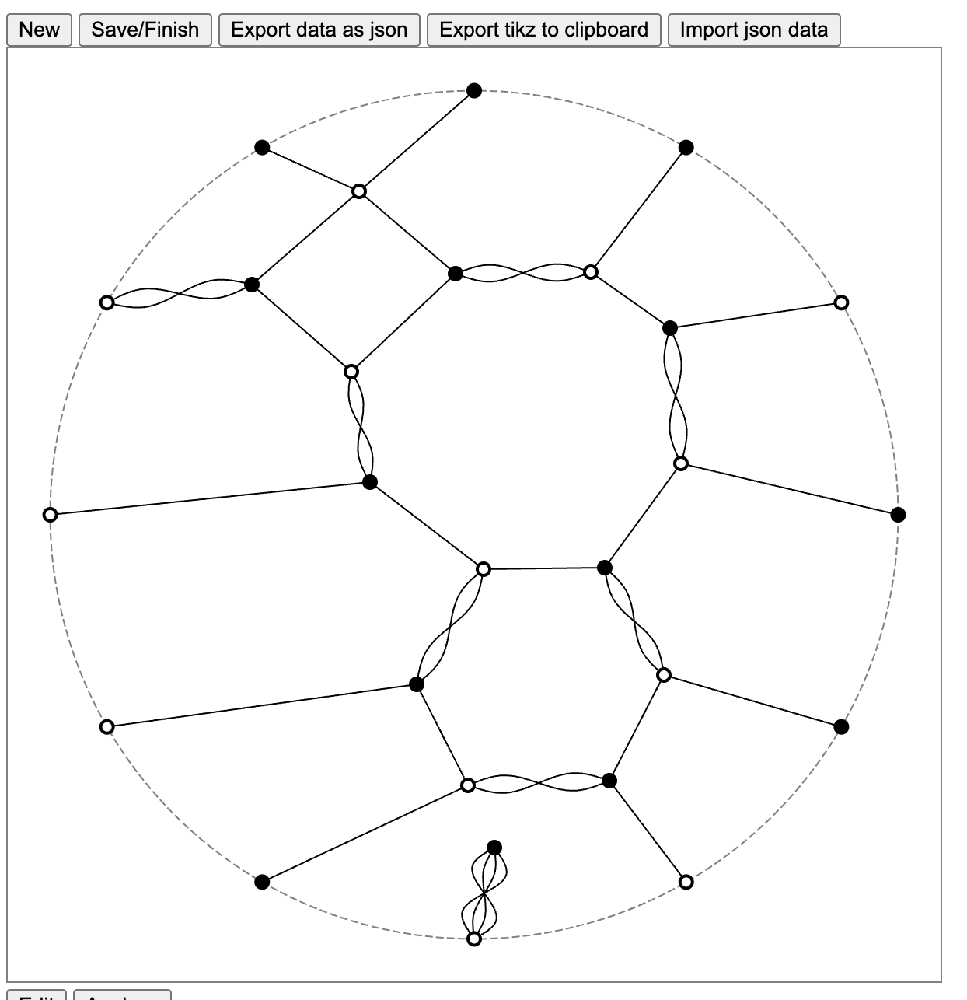

# Hourglass-Plabic-Graphs

## Quick TODOs
- [x] fix vertex label enter, update, exit structure to be more concise
    - can probably just use `.join()`
- [x] fix connectedness issue with the face rendering

## TODOs
Large list of tasks in progress and to start:
- [x] ability to maintain multiple trip permutations
- [x] separate analyze and edit modes, possibly begin structuring functionality for modes to be added in future
- [x] faces
- [x] benzene move on faces
- [ ] square move on faces
    - refer to [fig2](/imgs/fig2.png)
- [ ] snap vertices to boundary
- [ ] benzene and square move equivalence methods
    - [ ] benzene move
    - [ ] square move
- [ ] algorithm for applying rules to the linear order style and converting to a circular style of graph
- [ ] conversion routine from stacked box picture to graph
- [ ] conversion from alternating sign matrices (these matrices and plane partitions are already implemented in sage)
- [ ] translation from conventional plabic graph
- [ ] proper labelings
    - s.t. around each internal vertex, the numbers 1-4 appear once each
    - this is already implemented in Dr. Swanson’s research code for smaller webs
- [ ] tagging vertices with edge starting point
ability to get dual graph
- [ ] permutations of the boundary vertices — trouble is this model is very unstructured, so may not be interesting enough to warrant implementing
- [ ] symmetrized six-vertex pictures: convert to plabic, partial convert from plabic in contracted case
- [ ] tags
- [ ] Chris Fraser 2-column case
- [ ] uncrossing rules, other reduction rules, formal sums of webs
- [ ] separation labeling

## Open questions
Some questions I have accumulated while implementing features above

- How to create faces in graphs such as the following, where there is a disconnected component?
 Currently, we require planarity and connectedness before generating faces.

